4 вариант. 

# Дано:
- периодический сигнал (меандр) амплитудой 1 В;
- частота \\(f_0 = 1400\\) Гц;
- частота дискретизации \\(f_d = K \\cdot f_0 \\), \\(K=[0.2; 1.6; 8] \\);
- количество гармоник \\(M = [2, 5, 12]\\);
- количество точек \\(N = 1024\\);
- сигнал содержит 10 периодов

# Задание:
Разложить сигнал в ряд Фурье, построить амплитудную и фазовую спектрограммы, Для каждого из 3-х заданных чисел гармоник M совершить обратное преобразование Фурье. Определить номер наивысшей гармоники, существенной для восстановления сигнала (уровень 0,1), и восстановить сигнал для гармоник, ограниченных  найденной частотой. Для всех случаев вычислить ошибку восстановления (среднее квадратическое отклонение между точным и приближенным значениями).

# Этапы решения задания

## Построение спектра изначального сигнала

Изначальная последовательность задается выражением:

``` Haskell
function :: Double -> Double
function t = fromInteger $ (-1) ^ i
  where
    i = floor (t * f0 * 2)
```

Функция построения графика выглядит следующим образом:
```haskell
plotOriginal =
  toFile fopt "posts/Lab2/Original_signal.svg" $do
    layout_title .= "Original signal"
    setColors [opaque blue]
    plot (line "" [zip discrets signal]) where
      discrets = [0.0, 1.0/fd .. (n-1)/fd]
      signal = map function discrets
      fd = n / (periods * period)
```
где частота дискретизации `fd` подобрана таким образом, чтобы 10 периодов исходного сигнала 
соответствовали 1024 отсчетам


Амплитудный и фазовый спектр можно найти с помощью следующих двух функций:

``` Haskell
ampSpectrum signal = map magnitude $ elems $ rfft $ listArray (0, n-1) signal where
  n = length signal

phaseSpectrum signal = map phase $ elems $ rfft $ listArray (0, n-1) signal where
    n = length signal
```

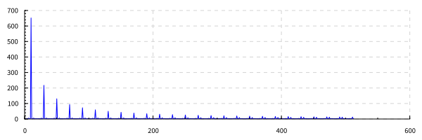
На рисунке 2 наблюдается характерная картина для сигнала типа меандр: присутствуют только нечетные гармоники.

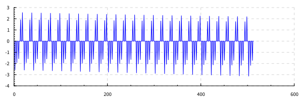

Функция которая восстанавливает сигнал по заданному количеству гармоник 
``` Haskell
signalFromHarmonics k signal = map ((*2) . realPart) $ elems $ ifft harmonics where
  spectrum = rfft $ listArray (0, n-1) signal
  harmonics = listArray (0, n-1) $ take k (elems spectrum) ++ replicate (n - k) (0.0 :+ 0.0)
  n = length signal
```
где `k` это количество гармоник дискретного преобразования Фурье. 
\\[f_k = \\frac{k}{T}\\]
где \\(T\\) период времени, в течение которого брались входные данные.

Для рассчета величины ошибки используется функция:
``` Haskell
calculateError s1 s2 = sqrt $ (/n) $ sum $ map (^^2) $ zipWith (-) s1 s2 where 
  n = fromIntegral $ length s1
```

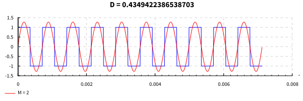

Так как спектр меандра не имеет четных частот, на рисунке 2 можно увидеть восстановленный сигнал в виде одной гармоники. Гармоника под номером 2 равна 0.

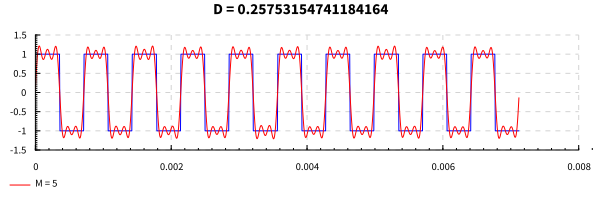

Аналогично рисунку 4, сигнал восстановленный по 5 гармоникам имеет форму суммы трех гармоник. Нулевыми гармониками являются 2 и 4

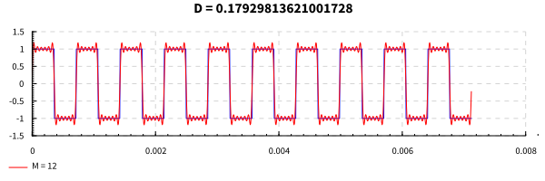

Аналогичная ситуация на рисунке 6.

Для поиска количества гармоник необходимого, чтобы обеспечить ошибку восстановления меньшую, чем `0.1`
используется рекурентная функция
``` Haskell
findMaxHarmonic01 :: [Double] -> Int
findMaxHarmonic01 = helper 0 where
  helper h s1 = 
    if calculateError s1 s2 < 0.1
    then h
    else helper (h+1) s1
    where s2 = signalFromHarmonics h s1
```

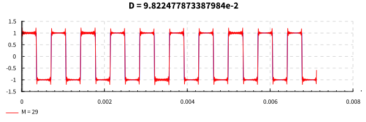

Как видно из рисунка 7 - 30 гармоник достаточно, для восстановления сигнала с заданной точностью.


## Дискретизация сигнала при \\(K = 0.2\\)

Найдем частоту дискретизации сигнала 

\\[fd = K \\cdot f0 = 0.2 \\cdot 1400 \\text{ Гц} = 280 \\text{ Гц} \\]

Проведем операцию дискретизации сигнала
 
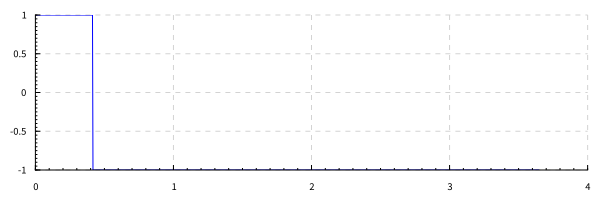

На рисунке 4 представлен график, который содержит более 1000 периодов оригинального сигнала, 
однако в следствие низкой частоты дискретизации проявляется стробоскопический эффект. В результате на графике представлен лишь один переход сигнала c 1 на -1.

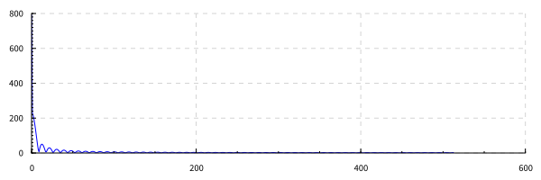

Спектр данного сигнала повторяет спектр одиночного прямоугольного импульса.

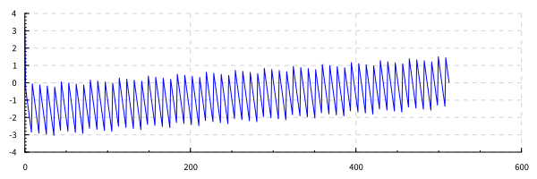


## Дискретизация сигнала при \\(K = 1.6\\)

Найдем частоту дискретизации сигнала 

\\[fd = K \\cdot f0 = 1.6 \\cdot 1400 \\text{ Гц} = 2240 \\text{ Гц} \\]

Проведем операцию дискретизации сигнала
 
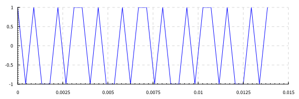

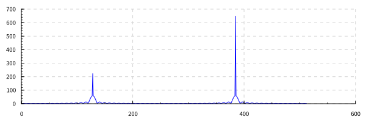

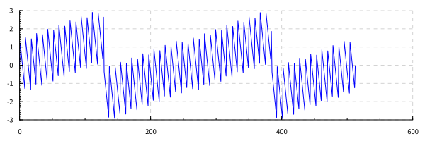


## Дискретизация сигнала при \\(K = 8\\)

Найдем частоту дискретизации сигнала 

\\[fd = K \\cdot f0 = 8 \\cdot 1400 \\text{ Гц} = 11200 \\text{ Гц} \\]

Проведем операцию дискретизации сигнала
 
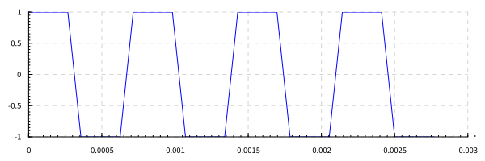

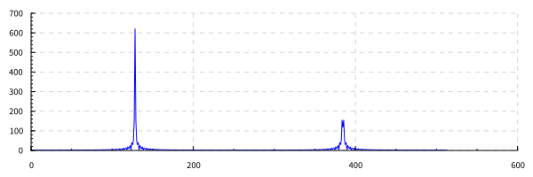

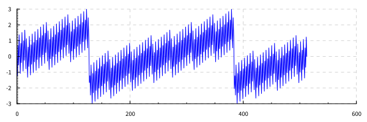


