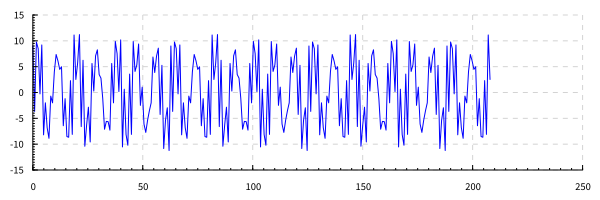
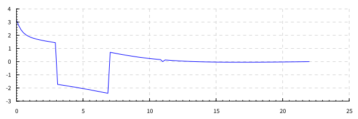

4 вариант. 

# Дано:
сигнал заданной формы: 
\\[s(t) = 5 \\cos 3t - 7 \\sin 7t + 4 \\cos 11t\\]

# Задание:
Определить верхнюю частоту исходного сигнала wв. Провести дискретизацию и построение амплитудного спектра сигнала для трех значений частоты:  \\(\\omega<\\omega_в\\), \\(\\omega=\\omega_в\\), \\(\\omega>2\\omega_в\\). Записать частоты компонент, объяснить результаты.

# Этапы решения задания

Верхняя частота равна\\(\\omega_в = 11\\)

Исходный сигнал преставляет собой сумму 3 грамоник с частотами 3, 7, 11.
Спектр сигнала должен содержать три явно выраженные гармоники на позициях 3, 7, 11.

## Сигнал с частотой дискретизации меньшей, чем верхняя частота сигнала

Частота дискретизации равна \\(\\omega_д = 0.7 \\cdot \\omega_в = 7.7\\)

Спектр сигнала в данном случае содержит три гармоники, однако, только одна из них находится в корректной позиции.
Верхняя частота спектра меньше 4. Седьмая и одиннадцатая гармоника были перенесены на новые позиции. 

## Сигнал с частотой дискретизации равной верхней частоте сигнала

Частота дискретизации равна \\(\\omega_д = \\omega_в = 11\\)

Спектр сигнала в данном случае содержит три гармоники, однако, только одна из них находится в корректной позиции.
Верхняя частота спектра равна 5.5. Седьмая и одиннадцатая гармоника были перенесены на новые позиции: 11 гармоника перенесена на нулевую частоту, 7 - на 4.

## Сигнал с частотой дискретизации втрое большей, чем верхняя частота сигнала

Частота дискретизации равна \\(\\omega_д = 4 \\cdot \\omega_в = 44\\)

# Выводы
На рисункаха 2 и 5 спектр не отражает оригинального набора частот. Данный факт является следствием недостаточной частоты дискретизации.

На Рис. 8 Все гармоники находятся на своих местах.
Данный результат является следствем теоремы Котельникова, которая говорит о том, что для достоверного 
восстановления продискретезированного сигнала частота дискретизации должна быть больше чем 2 верхних частоты 
сигнала.

