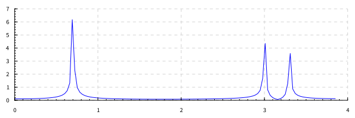
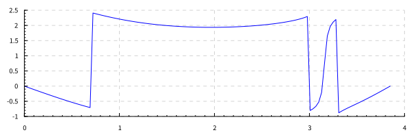
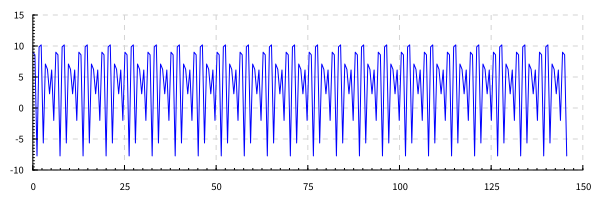
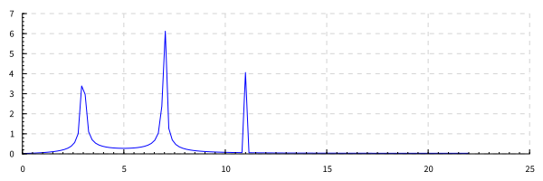

4 вариант. 

# Дано:
- периодический сигнал (меандр) амплитудой 1 В;
- частота \\(f_0 = 1400\\) Гц;
- частота дискретизации \\(f_d = K \\cdot f_0 \\), \\(K=[0.2; 1.6; 8] \\);
- количество гармоник \\(M = [2, 5, 12]\\);
- количество точек \\(N = 1024\\);
- сигнал содержит 10 периодов

# Задание:
Разложить сигнал в ряд Фурье, построить амплитудную и фазовую спектрограммы, Для каждого из 3-х заданных чисел гармоник M совершить обратное преобразование Фурье. Определить номер наивысшей гармоники, существенной для восстановления сигнала (уровень 0,1), и восстановить сигнал для гармоник, ограниченных  найденной частотой. Для всех случаев вычислить ошибку восстановления (среднее квадратическое отклонение между точным и приближенным значениями).

# Этапы решения задания

