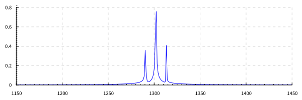
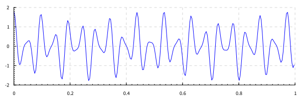
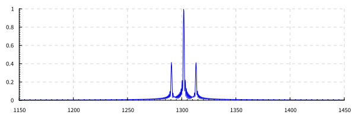
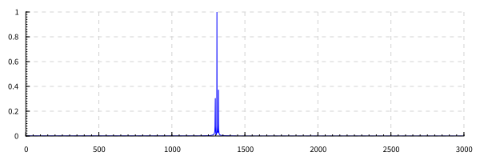

4 вариант. 

# Дано:
сигнал с амплитудной модуляцией вида
\\[a(t) = (1 + A \\cos(2\\pi\\cdot f_A \\cdot t)\\cdot \\cos(2\\pi\\cdot f_0\\cdot t)\\]
Частота дискретизации \\(f_d\\). Длительность сигнала 1 секунда.

- \\(f_0 = 1300.6\\) Гц;
- \\(f_A = 11.3\\) Гц;
- \\(f_d = 4096\\) Гц;
- \\(A = 0.8\\);
- \\(L = 4\\).


# Задание:
1) Путем децимации (уменьшения частоты дискретизации) сделать перенос спектра сигнала так, чтобы центральная частота сигнала принадлежала диапазону \\([2f_a;8f_a]\\).
2) Увеличив длину последовательности отсчетов дополнением нулями, повысить разрешающую способность по частоте в 4 раза.
3) С помощью процедуры интерполяции (или восстановлением отсутствующих отсчетов) дискретного сигнала увеличить частоту дискретизации в L раз. 


# Этапы решения задания

## Оригинальный сигнал

В первую очередь построим оригинальный сигнал.

``` Haskell
function :: Double -> Double
function t = (1 + a * cos(2* pi * fa * t)) * cos(2 * pi * f0 *t)
```




## Децимация сигнала

Для того чтобы построить сигнал принадлежал диапазону \\([2f_A;8f_A]\\)
понизим частоту дискретизации в 16 раз: 

`fd' = fd / 16.0`




## Повышение разрешения спектра

Дополним сингнал нулями. Для обеспечения \\(L=4\\) на 1 часть сигнала необходимо 3 части нулей:

``` Haskell
signal = map function discrets ++ replicate (3 * floor n) 0.0
```



## Интерполяция сигнала

Операция дополнения нулями выглядит как 

``` Haskell
signal' = concatMap (\x -> x : replicate (l-1) 0.0) signal
```


Стром спектр сигнала, где каждый отсчет дополнен нулями.


Спектр на рисунке 8 содержит высокочастотную компоненту, которая не удолетворяет условиям теоремы Котельникова и которая отразилась относительно частоты \\(f_d/2\\) в текущую область частот. 

Подавим данную частоту. 



Из оставшегося спектра восстановим сигнал. Данный сигнал и будет интерполированным сигналом. 


# Выводы

В данной работе рассмотрены различные деформации дискретного сигнала.