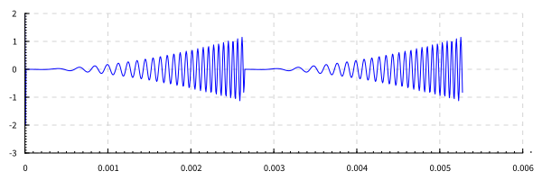
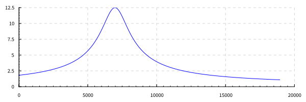
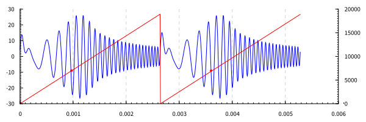

4 вариант. 


# Дано:
- \\(f_0=380\\)
- \\(f_v=19000\\)
- \\(A = 4\\)
- \\(r = 0.92\\)
- \\(f_c = 7000\\)


# Задание:
Задан сигнал с линейной частотной модуляцией. Реализовать его фильтрацию КИХ и БИХ фильтрами  1-го и 2-го порядков (черезпериодный вычитатель первого и второго порядков, рециркулятор, комплексный резонатор).


# Этапы решения задания

## Определение КИХ и БИХ фильтров

Опрелелим период сигнала из частоты следования импульсов:
`period = 1/f0` 

Ниже представлена функция задающая сигнал с линейной частотной модуляцией (ЛЧМ), продискретезированный сигнал и расчет дискретов:

``` Haskell
chirp :: Double -> Double
chirp t = a * cos(2 * pi * fv / (2 * period) * t' ^^ 2) where
    t' = t - period * fromIntegral (floor (t / period))

signal = map chirp discrets

discrets = [0.0, 1/fd .. 2 * period]
```

Функция построения сигнала:

``` Haskell
plotSignal =
  toFile fopt "posts/Lab5/signal.svg" $do
    setColors [opaque blue]
    plot (line "" [zip discrets signal])
```


В первую очередь необходимо определить функцию фильтрации сигнала при помощи 
БИХ фильтра:

``` Haskell
-- a, b список коэффициентов БИХ фильтра. Например фильтр 2 порядка: [a0,a1,a2] [b0,b1,b2]
-- xs отсчеты сигнала
iir :: Num a => [a] -> [a] -> [a] -> [a]
iir a b xs = helper xs zeros zeros where
  zeros = replicate rank 0
  rank = max (length b) (length a)  -- - 1
  helper [] _ _ = []  -- вспомогательная функция для прохода по всему сигналу
  helper ns x_mem y_mem = next : helper (tail ns) x_mem' y_mem' where
    next = sum (zipWith (*) b x_mem') - sum (zipWith (*) a $ 0:y_mem)
    y_mem' = next : init y_mem 
    x_mem' = head ns : init x_mem
```

В данной функции используется вспомогательная функция `helper` имеет рекурентный вызов и хранит два списка `y_mem`, `x_mem` для записи предидущих значений

``` Haskell
y_mem' = next : init y_mem 
x_mem' = head ns : init x_mem
```

Рассчет следующего элемента фильтрации происходит в выражении:

``` Haskell
next = sum (zipWith (*) b x_mem') - sum (zipWith (*) a $ 0:y_mem)
```


КИХ фильтр в свою очередь выводится из функции БИХ фильтра:
``` Haskell
-- КИХ фильтр как частный случай БИХ фильтра
fir = iir []
```


## Черезпериодный вычитатель

Черезпериодный вычитатель 1 порядка задается как функция `[Double] -> [Double]` 
и выводится из общей функции КИХ фильтра с коэффинциентами `[-1,1]`, которые 
эквивалентны выражению \\(H(z) = -z^{-1} + 1\\)

``` Haskell
fir1 = fir [-1, 1]
```


Черезпериодный вычитатель 1 порядка - КИХ фильтр с коэффинциентами 
`[0.5, -1, 0.5]`, которые эквивалентны выражению \\( H(z) = 0.5 z^{-2} -z^{-1} + 0.5\\)

``` Haskell
fir2 = fir [0.5, -1, 0.5]
```


Черезпериодный вычитатель предназначен для фильтрации (подавления) неподвижного
фона относительно быстрых подвижных целей.
Фильтр 2 порядка подавляет постоянную составляющую заметно сильнее.


## Рециркулятор

Рециркулятор задается выражением:

``` Haskell
iir1 = iir [1, -r] [1]
```

Что эквивалентно дроби:
\\[ H(z) = \\frac{1}{1-r\\cdot z^{-1}}\\].


Такой фильтр можно использовать для выделения медленных сигналов,
наблюдаемых на фоне высокочастотных помех. В
радиолокации такой фильтр, называемый
рециркулятором, используется для последетекторного
накопления отсчетов.

## Комплексный резонатор

Комплексный резонатор выражением

``` Haskell
iir2 = iir [0,-k] [1] where
  k = (r :+ 0) * exp (j * pi * ((fc / (fd/2) ) :+ 0))
```

Эквивалентная дробь:
\\[ H(z) = \\frac{1}{1-r \\cdot e^{j\\omega_0}\\cdot z^{-1}}\\].

Комплексный резонатор эквивалентен колебательному контуру. Построим АЧХ резонатора.
 


На рисунке 6  пердставлен результат фильтрации ЛЧМ сигнала при помощи комплексного резонатора. Красной точкой отмечен момент времени, когда на вход фильтра поступает сигнал с частотой \\(f_c =7000\\) Гц.



Как видно максимум входного сигнала находится чуть позже, чем момент поступления 
на вход частоты 7000 Гц. Это происходит из-за слишком быстрого нарастания 
частоты ЛЧМ сигнала. 

Ниже приведен пример, где фильтруется сигнал при с увеличенным периодом в 20 раз использовании того же фильтра. Максимум отфильтрованного сигнала совпадает с частотой настройки фильтра 7000 Гц.


Комплексный резонатор реализует когерентное (т.е. с 
компенсацией фазового сдвига) накопление отсчетов
комплексного входного сигнала.


# Выводы 

В данной работе были созданы функции для генерации КИХ и БИХ фильтров общего вида.
Кроме того были построены несколько простых фильтров. Данными фильтрами была проведена фильтрация ЛЧМ сигнала с ожидаемыми результатами.